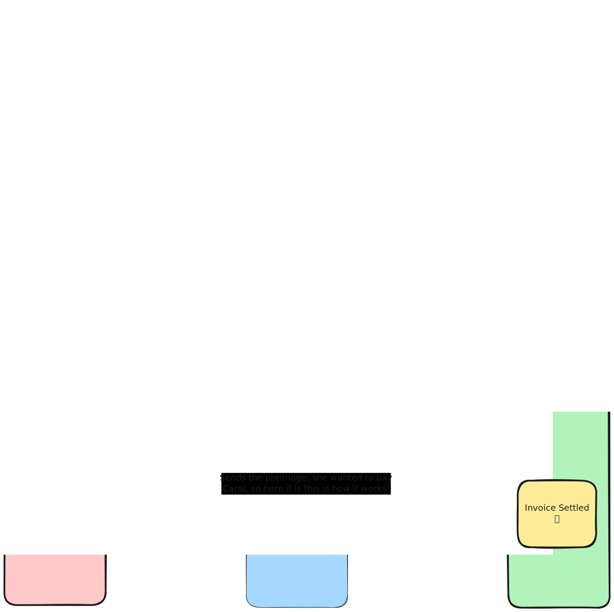

# Lightning Blinder
Trick an LSP into thinking *one* wallet is the sender or recipient when it's *really* some other wallet

# What is this?
This is privacy software for the lightning network. It has several goals: (1) lower the barrier for people to route payments even if they only have a cell phone that is off most of the time (2) make it easier to manually add such people to your routes on the lightning network (3) disrupt the assumptions LSPs use to guess the senders and recipients of lightning payments

# How to try it?
This is only proof of concept software and it is easy to lose money with it. So don't do so unless it's for science or entertainment or something.

That said, just click here: https://supertestnet.github.io/lightning_blinder/

# Video demo

# Why did you make this?
Sometimes I talk to people about lightning network privacy, and I am told that most lightning network users rely on custodians and LSPs for their payments, and if you use those, you don't get great privacy. Even some LSPs say that they can trace lightning payments that flow through them.

For example, Phoenix Wallet has an FAQ that says, "The current version of Phoenix offers no advantage regarding privacy over existing, hosted, custodial wallets. We (ACINQ) know the final destination and amount of payments." [source](https://phoenix.acinq.co/faq) I asked Phoenix for more details about this on twitter, where they pointed out that there is an exception, a case where they *cannot* know the final destination of payments: "in the most common case we can tell the destination...But YMMV [your mileage may vary]...[the] destination may be itself a trampoline node." [source](https://x.com/PhoenixWallet/status/1916844583402590504)

This is insightful: Phoenix cannot tell if the destination of a lightning invoice is the "real" recipient or "a trampoline node" -- which is a type of routing node on the lightning network that sort of serves as a "decoy" recipient. (For more info, see [lnproxy.org/about.html](https://lnproxy.org/about.html).) Phoenix assumes that "in the most common case" a lightning invoice sends the money to a real person directly, without using a decoy (a trampoline node). My motivation with this software is to invalidate Phoenix's assumption and make decoys (trampoline nodes) more common on the lightning network. Below, I describe a protocol for doing so.

By the way, if this software works, it should improve LN privacy regardless of whether you use an LSP, a custodian, or a self-hosted node. But we'll see.

# Protocol setup
The protocol requires three pieces of software: Lightning Blinder Send (LBS), Lightning Blinder Receive (LBR), and Lightning Blinder Coordinate (LBC).

LBS needs to be software that can do two things: (1) send LN payments (2) communicate with LBR in a manner to be described shortly.

LBC needs to be software that can do three things: (1) send LN payments (2) receive LN payments (3) communicate with LBR in a manner to be described shortly. Without taking custody of user funds, it will serve as a decoy recipient: the LSP will *think* it is sending money to LBC but it's *really* sending money to LBR.

LBR needs to be software that can do five things: (1) create hodl invoices (2) detect when a hodl invoice's state changes from "open" (not paid yet) to "pending" (i.e. the invoice has an htlc in a pending state, but it hasn't been settled or resolved yet) (3) receive LN payments (4) communicate with LBC in a manner to be described shortly (5) communicate with LBS in a manner to be described shortly.

# Protocol flow

The protocol begins when LBR decides it wants to receive money. First it reaches out to LBC and tells it what amount it wants to receive. LBC then creates a standard lightning invoice for that amount (or possibly a bit more, e.g. the LBC might charge a fee) and gives it to LBR -- we will call this invoice the "original invoice." Next, LBR creates a "wrapped invoice" -- an invoice for the same amount as the original invoice (or a bit less, if LBC added a fee), locked to the same preimage as the original invoice, but with a larger timelock value.* LBR gives this "wrapped invoice" to LBC, who pays it, knowing LBR cannot settle the invoice because LBR does not know the preimage -- only LBC knows that at this time.

Once LBR detects that the invoice's state changed from "open" to "pending," it should take the "original invoice" and show it to LBS, and append to the invoice some data about a communication channel by which LBS can communicate with LBR. LBS now pays the original invoice. Assuming LBS uses an LSP that constructs the payment route, the LSP will *think* it is paying LBC, because that is the node whose pubkey appears in the invoice.

But here's where things get fun: if the payment fails, no payment happened, so there is nothing useful for the LSP to learn; you can't trace a payment that never happens. And if the payment succeeds, then due to the way the lightning network works, LBS necessarily receives the preimage that not only resolves the *original* invoice -- it is also capable of resolving the *wrapped* invoice, because that is locked to the *same preimage.*

So now LBS *sends* that preimage to LBR via the communication channel provided when LBR showed LBS the original invoice (i.e. the communication channel LBR appended to the original invoice, as described above). Once LBR receives the preimage from LBS, it uses that preimage to *settle the wrapped invoice* -- thus completing the route. LBC routed a payment from LBS to LBR, without taking custody of any money, and without its wallet needing any code for routing.

# Why this is cool
This protocol enables a bunch of cool features:

- The LBC software is very simple and can use any lightning backend that can send LN payments and receive LN payments. That means anyone can run LBC on top of basically any lightning wallet and charge fees for the use of this blinding software.
- People who want better privacy than they can get from a regular LSP can use one or more LBCs as a kind of "LN routing vpn," enhancing their privacy.
- Lightning Blinder ruins the heuristics LSPs use to identify recipients. The LSP will think they are forwarding a payment to person A (the LBC) but the money is really going to person B (the LBR). Thus they can no longer reliably trace a payment to the correct recipient, as long as the recipient is using Lightning Blinder.
- LSPs cannot tell if you are using Lightning Blinder. The only thing indicating that is the information appended to the original invoice, but LSPs do not see that information, only LBS does, and he has no reason to share it with the LSP.
- Wallets thus get a privacy advantage without even using the software. Because of its undetectability, if even a small percentage of people use Lightning Blinder, LSPs can no longer be sure their heuristics work for *anyone,* because they cannot detect who is using it and who isn't.

# How to hide the sender too
The protocol as described above fools an LSP into thinking one of their users is sending money to person A when they are really sending money to person B. But there is another way to use Lightning Blinder: have person A -- who I have decided to call Quincy, momentarily -- run the LBC software.

Now suppose a user of Lightning Blinder -- whom I shall call Robert -- picks Quincy as their LBC, and suppose a man named Paul wants to pay Robert through Quincy -- so the payment is going Paul -> Quincy -> Robert. When Robert receives the payment from Paul (through Quincy), Paul's LSP thinks Quincy is the recipient when the real recipient is Robert. But that's not all: Quincy is using an LSP too, and Quincy's LSP will think *Quincy* is the sender when he's actually forwarding a payment from Paul to Robert. So not only do you hide Robert (the real recipient), you also hide Paul (the real sender).

Thus Lightning Blinder ruins the heuristics used by LSPs to identify recipients *and senders.* If Lightning Blinder sees just a little adoption, LSP heuristics won't work anymore and they will be unable to identify senders and recipients. Even if the payment looks like it's going directly from one of their users to another, they won't know if those people are the "real" senders and recipients or just LBCs forwarding payments for other people. And privacy on the lightning network will be significantly enhanced.

# Read this if you think this sounds like LN Proxy
LN Proxy (https://github.com/lnproxy) is similar software that *also* hides the "real" recipient from people like LSPs. But only a few people run LN Proxy and I think that's largely because it has a pretty advanced setup procedure: you have to install LND (because other LN implementations don't natively support hodl invoices), run LN Proxy on top of it, and configure a server to expose the web interface so folks can use it. With Lightning Blinder, I want to eliminate those requirements.

I want anyone to be able to run all the pieces of software easily -- you just click a button to run the server directly in your browser, connect the server to almost any lightning wallet (hopefully via NWC), and you're done. Leave it running and check in later to see if you made any money. I plan to lower the barrier to entry compared to LN Proxy by (1) not requiring coordinators to install a wallet that supports hodl invoices (instead, they can use almost ANY lightning wallet) (2) designing the server so you can just run it in your browser.

If coordinators simply make their feerates public (probably via nostr), users can see a list of them and pick one or more coordinators based on their feerates. All the "important" logic can thus be handled on the client side, by the sender and the recipient. I can build a prototype wallet to demonstrate that the protocol works, and then other wallets can implement support for this protocol if there's demand. Hopefully, privacy on the lightning network will improve as a result.

# *Asterisk
Earlier I said it is important that the "wrapped invoice" created by LBR have a higher timelock value than the one created by LBC. This is because of the following risk: suppose LBR's invoice expires after 3 days and LBC's expires after 10 days. LBC could wait til LBS pays the 10 day invoice, then refuse to disclose the preimage; once 3 days go by, LBR's invoice expires, so now LBC doesn't have to pay them anything. But LBS's payment is still pending -- so LBC can settle it using the preimage and thus "get" paid without having to "pay" anything, which is robbery.

To prevent this, all I have to do is ensure LBR's wrapped invoice expires AFTER LBC's. That way, if LBC's invoice expires after 3 days and LBR's expires after 10 days, it does LBC no good to "wait" to settle LBS's payment. LBS's payment will expire if he waits longer than 3 days and then LBC cannot get any money. So his only option to get money is to settle LBS's payment, thus giving LBS the preimage, who then sends it to LBR, who settles his payment with it.
